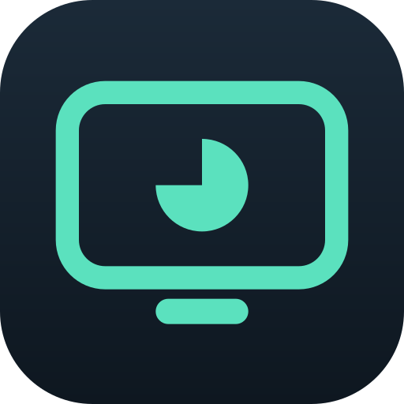

# TV Sitter

Parental control for **Android TV / Google TV**, driven from **Home Assistant**.
Screen time limits, per-app blocking, a PIN-protected lock screen and — above all —
**a "may I have more time?" request from the remote that a parent answers with one tap
on their phone**.

Runs on your network. No cloud, no subscription.

> **Status: pre-alpha.** Milestone M0 is in progress — the skeleton stands and the rules
> tests pass, but nothing has been run on a real TV yet. Not usable.

## Why this exists

The starting point was [TVCP Guardian](https://play.google.com/store/apps/details?id=io.middlepoint.tvcp.guard),
which works well and covers most of what you would expect. Three things were missing,
and those are the reason for this project.

| | TVCP Guardian | TV Sitter |
|---|---|---|
| Price | 2.99 USD/month or 19.99 USD/year, 7-day trial | free, AGPL |
| Number of TVs | 1 per subscription | unlimited (topics carry a device id) |
| Time limit, app blocking, sleep timer, PIN | yes | yes (M2/M4) |
| Weekly schedules | announced | M4 |
| **"More time" request from the TV → actionable notification for the parent** | no | **M3, the main reason this exists** |
| **Usage statistics and history** | no | **M5, via the Home Assistant recorder** |
| **At-a-glance "is the TV on, what is running"** | no | **M1** |
| Where the data lives | vendor cloud | your MQTT broker and your Home Assistant |

## How it works

```
┌─ Android TV / Google TV ─────────────────────┐        ┌─ Home Assistant ─────────────┐
│ EnforcerService (foreground service)         │        │ custom_components/tvsitter   │
│  • detects the foreground app (usage events) │        │  • entities: screen, app,    │
│  • draws a lock screen over other apps       │  MQTT  │    time left, lock switch    │
│  • counts screen time                        │◄──────►│  • time requests → push      │
│ RulesEngine (:rules, plain Kotlin)           │        │  • dashboard and statistics  │
└──────────────────────────────────────────────┘        └──────────────────────────────┘
```

**No accessibility service.** The permission asked for is "draw on top", not "read everything
on screen and every keystroke" — and merely having an accessibility service enabled stops
Android masking password fields, so a parent typing their account PIN on the TV would do it in
front of an audience. See D15 and D16 in [`docs/architecture.md`](docs/architecture.md).

The decision to block is made **on the TV**. A Home Assistant outage, a dropped Wi-Fi
link or a broker restart cannot unlock the TV. Home Assistant supplies the rules, shows
the state and handles requests for extra time.

Why not simply drive everything over ADB from Home Assistant, and every other decision
made so far: [`docs/architecture.md`](docs/architecture.md). The interface between the two
halves: [`docs/mqtt-contract.md`](docs/mqtt-contract.md).

## Requirements

- A TV or streaming device running Android TV / Google TV, **Android 8 or newer**.
- Home Assistant with an MQTT broker (the Mosquitto add-on is enough).
- ADB once, to grant the permissions Android TV will not let you grant from the remote —
  see [`docs/setup.md`](docs/setup.md).

Fire TV (Fire OS), Samsung (Tizen), LG (webOS) and Roku are not supported.

## Installation

**On the TV:** [`docs/setup.md`](docs/setup.md).

**In Home Assistant:** eventually through HACS as a custom repository —
`custom_components/tvsitter` already follows the HACS layout. Until then, copy the
`custom_components/tvsitter/` directory into your `config/custom_components/` and restart
Home Assistant.

## Roadmap

| | Milestone | Contents |
|---|---|---|
| M0 | foundation | repository, toolchain, app skeleton, on-device spike |
| M1 | telemetry | screen state and active app surfaced in Home Assistant |
| M2 | counter and lock | daily budget, day starting at 04:00, lock screen, PIN |
| M3 | time requests | button on the TV → actionable notification → granted time |
| M4 | rules | weekly schedule, allowed time windows, per-app budgets |
| M5 | statistics and anti-tamper | dashboard, Settings lockout, alarm when the app dies |
| M6 | going public | documentation, release, HACS submission |

## License

[AGPL-3.0-only](LICENSE). You may use, modify and redistribute it, provided you publish
the source of your changes under the same terms. Contribution rules and CLA:
[`CONTRIBUTING.md`](CONTRIBUTING.md).

## Disclaimer

An independent project, not affiliated with Google, Philips/TPV or MiddlePoint Solutions.
Android TV and Google TV are trademarks of Google LLC.
